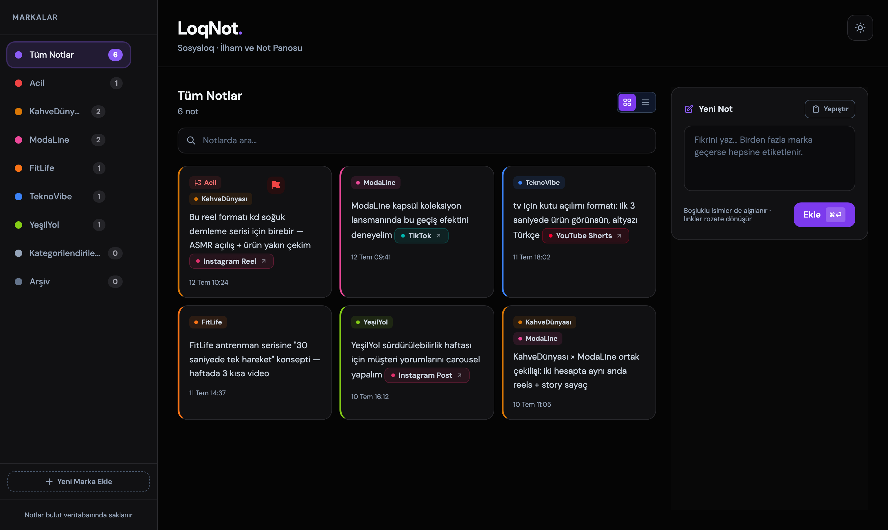
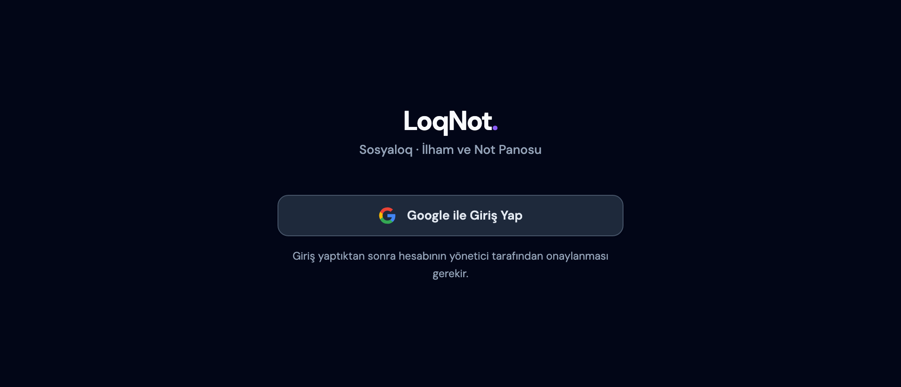

# LoqNot

**Sosyal medya ajansları için marka bazlı içerik-ilham panosu.**

🔗 **Canlı site:** [loqnot.vercel.app](https://loqnot.vercel.app)


Sosyal medya ekipleri gün içinde onlarca iyi içerik görür: *"Bu Reel formatı bizim müşteriye birebir uyar."* Sorun, o anlık fikrin akışta kaybolmasıdır. LoqNot bunun için var — gördüğün içeriğin linkini yapıştır, hangi markaya uyduğunu yaz, gerisini uygulama halleder.

[Sosyaloq](https://sosyaloq.com) ajansının günlük iş akışı için tasarlandı ve ekip tarafından aktif olarak kullanılıyor.

> **EN ·** LoqNot is a brand-aware content inspiration board for social media agencies: paste a link, mention a client, and the note auto-tags itself and syncs to the whole team in real time. A dependency-free, single-file PWA backed by Firebase — Firestore for realtime data, Google sign-in with admin approval for access control. Built as a self-taught side project by a social media professional; in daily use by the Sosyaloq team.


*Örnek verilerle pano görünümü: notlar markalara otomatik etiketlenir, linkler platform rozetine dönüşür, acil işler üste sabitlenir.*

## ✨ Özellikler

- **Otomatik marka algılama** — Nota "özgür koldaş şuna benzer bir video çekebilir" yazarsınız, not kendiliğinden Özgür Koldaş kategorisine etiketlenir. Kısaltmalar da tanınır (`ök`, `ok` gibi), birden fazla marka geçerse hepsine etiketlenir.
- **Akıllı link rozetleri** — Yapıştırılan linkler ham URL olarak değil, platform renginde şık rozetler olarak görünür: `● Instagram Reel ↗`, `● TikTok`, `● YouTube Shorts`...
- **Acil bayrağı** — Öncelikli işler tek dokunuşla işaretlenir, her listede otomatik en üste çıkar.
- **Arşiv akışı** — Çekilen/tamamlanan fikirler tik ile arşive taşınır, marka listelerini kalabalıklaştırmaz.
- **Akıllı kenar çubuğu** — Markalar not sayısına göre sıralanır, boş markalar tek satıra katlanır.
- **Kapsamlı arama** — Hem not metninde hem marka adı ve kısaltmalarında arar.
- **Kart / kompakt liste görünümü** — Tercihe göre iki yerleşim, seçim hatırlanır.
- **Açık / koyu tema** — Sistem tercihini algılar, elle değiştirilebilir.
- **Gerçek zamanlı senkronizasyon** — Bir cihazda eklenen not, açık olan tüm cihazlarda anında görünür.
- **Google ile giriş + yönetici onayı** — Ekip üyeleri kendi Google hesabıyla girer, yönetici onaylayana kadar hiçbir veriye erişemez. Onay geldiği an ekran kendiliğinden açılır.
- **Uygulama içi onay paneli** — Yönetici bekleyen istekleri rozetli panelden tek tıkla onaylar, reddeder veya sonradan erişimi geri alır.
- **PWA** — Telefonda ana ekrana eklenir, uygulama gibi açılır.

## 🧠 Nasıl çalışır?

```
"şu reel formatını ök için uyarlayalım https://instagram.com/reels/..."
        │                │                        │
        │                │                        └─ platform algılanır → "● Instagram Reel ↗" rozeti
        │                └─ "ök" kısaltması eşleşir → not Özgür Koldaş'a etiketlenir
        └─ not gerçek zamanlı olarak tüm ekibin panosuna düşer
```

Marka eşleştirme Türkçe'ye duyarlıdır (`toLocaleLowerCase('tr-TR')`), boşluklu marka adlarını ve virgülle tanımlanan kısaltmaları destekler.

## 🔐 Erişim modeli

Pano ekip içi kullanım için olduğundan erişim iki katmanla korunur:

1. **Kimlik** — Firebase Authentication üzerinden Google ile giriş. Şifre saklanmaz, hesap yönetimi Google'a bırakılır.
2. **Onay** — Giriş yapmak yetmez: kullanıcı `pendingUsers` listesine düşer ve yönetici uygulama içindeki panelden onaylayana kadar bekleme ekranında kalır. Onay durumu canlı izlendiği için onay verildiği an uygulama açılır, geri alındığı an kapanır.



Kritik nokta: bu kontrol sadece arayüzde değil, [`firestore.rules`](firestore.rules) ile **veritabanı seviyesinde** uygulanır. Notlara yalnızca yönetici ve `allowedUsers` koleksiyonundaki e-postalar erişebilir; onay listesini yalnızca yönetici değiştirebilir. Böylece istemcideki Firebase config'inin herkese açık olması bir güvenlik sorunu yaratmaz — config zaten gizli değildir, güvenliği kurallar sağlar.

## 🛠 Teknoloji

| Katman | Tercih | Neden |
|---|---|---|
| Arayüz | Vanilla JS + Tailwind CSS | Bağımlılık yok, build adımı yok — tek `index.html` |
| Veri | Firebase Firestore | Gerçek zamanlı senkron, ücretsiz katman üç kişilik ekibe fazlasıyla yeter |
| Kimlik | Firebase Auth (Google) + yönetici onayı | Şifresiz giriş; erişim Firestore kurallarıyla veritabanı seviyesinde kısıtlı |
| Dağıtım | Vercel (statik hosting) | Sunucu maliyeti sıfır, push ile otomatik yayın |
| Mobil | PWA (manifest + service worker) | App Store'suz "uygulama" deneyimi |

Bilinçli bir tercih olarak framework kullanılmadı: proje tek HTML dosyasından oluşur, herhangi bir tarayıcıda doğrudan açılır ve bakımı kod bilmeyen birine bile devredilebilecek kadar basittir.

## 🚀 Çalıştırma

Derleme yok. Klonlayın ve açın:

```bash
git clone https://github.com/odtaskesen/LoqNot.git
cd LoqNot
python3 -m http.server 8000
# http://localhost:8000
```

> Kendi kopyanız için [Firebase konsolundan](https://console.firebase.google.com) ücretsiz bir proje oluşturun, `index.html` içindeki `firebaseConfig` ve `ADMIN_EMAIL` değerlerini kendinize göre değiştirin, Authentication'da Google sağlayıcısını etkinleştirin ve [`firestore.rules`](firestore.rules) içeriğini Firestore kurallarınıza yapıştırın.

## 📁 Dosya yapısı

```text
LoqNot/
├── index.html            # Uygulamanın tamamı (arayüz + mantık + giriş akışı)
├── firestore.rules       # Veritabanı erişim kuralları (onaylı kullanıcı modeli)
├── manifest.webmanifest  # PWA tanımı
├── sw.js                 # Service worker (çevrimdışı kabuk önbelleği)
└── icons/                # Uygulama ikonları
```

## 👋 Bu projeyi kim, neden yaptı?

Ben yazılımcı değilim — [Sosyaloq](https://sosyaloq.com)'ta sosyal medya uzmanıyım. LoqNot, ekibimizin her gün yaşadığı somut bir sorunu çözmek için kendi kendime öğrenerek geliştirdiğim bir yan proje: gördüğümüz iyi içerikleri müşterilerimize uyarlama fikirlerini akışta kaybetmeden tek yerde toplamak.

Hazır bir not uygulaması yerine kendimiz yapmayı seçtim; çünkü ihtiyacımız çok spesifikti (marka algılama, Türkçe kısaltmalar, link rozetleri) ve sürecin her adımı — ürünü tasarlamak, gerçek zamanlı veritabanı kurmak, kimlik doğrulama ve onay sistemi eklemek, canlıya alıp ekibe kullandırmak — benim için birebir öğrenme fırsatıydı. Bugün ekip tarafından her gün aktif olarak kullanılıyor.
